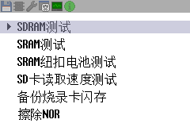
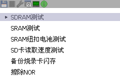
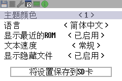
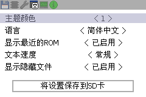
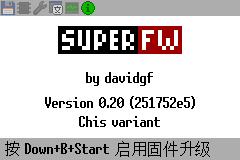
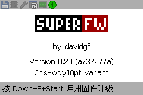

SuperFW（WenQuanYi 分支）
========================

本分支跟踪上游 [`davidgfnet/superfw`](https://github.com/davidgfnet/superfw)，并在
`v0.20-wqy10pt-r3` 之后整合了以下改动：

- 使用 WenQuanYi 10pt 作为主界面字体，并以 Fusion Pixel 补足字形；中文为默认界面语言。
- 为 SuperCard Chis 提供扩展字体固件和 `NO_SD_MODE=1` 模拟器构建。全量字体包不适合
  SuperCard SD/Lite 的 ROM 容量，因此 Release 仅发布 Chis 固件。
- ROM、最近游戏和 NOR 浏览器支持封面预览。封面改为读取可选的
  `/.superfw/covers.pak` 分页资源包，避免分散缓存文件访问，并提供离线构建、格式校验和
  已验证中文 ROM 地区封面别名。
- 记住“隐藏扩展名”选项，在最近游戏列表显示 Flash 标识；改进封面切换、SD 临时读取错误
  恢复、NOR/最近游戏启动和存档路径处理。
- 整合游戏内菜单“重置并加载存档”、非阻塞 Flash 擦除、并行 SDRAM 读取、压缩器更新、
  翻译和补丁数据库更新，以及相关测试和 CI 发布流程。

封面包是可选项：将 Release 中的 `superfw-covers.pak` 放到 SD 卡根目录下的
`/.superfw/covers.pak`，重启后即可显示匹配游戏码的封面。缺少封面包不会影响游戏启动。

SuperFW (WenQuanYi fork)
========================

This fork tracks upstream [`davidgfnet/superfw`](https://github.com/davidgfnet/superfw)
and includes the following changes since `v0.20-wqy10pt-r3`:

- WenQuanYi 10pt is the primary UI font, with Fusion Pixel fallback glyphs;
  Chinese is the default UI language.
- It provides the extended-font and `NO_SD_MODE=1` emulator builds for
  SuperCard Chis. The full font package does not fit the SuperCard SD/Lite ROM
  budgets, so Releases publish Chis firmware only.
- ROM, recent-game, and NOR browsers support cover previews. Covers are read
  from the optional paged `/.superfw/covers.pak` resource, replacing scattered
  cache access, with offline generation, format validation, and verified
  regional-cover aliases for compatible Chinese ROMs.
- The hide-extension setting persists, Flash titles are marked in the recent
  list, and cover switching, transient SD-read recovery, NOR/recent launching,
  and save-path handling are improved.
- The branch also integrates reset-and-load-save in the in-game menu,
  non-blocking Flash erase, parallel SDRAM reads, compressor updates,
  translation and patch-database updates, plus related tests and CI release
  automation.

The cover pack is optional. Copy the Release's `superfw-covers.pak` to
`/.superfw/covers.pak` at the SD-card root and restart to show covers for ROMs
with matching game codes. Games still launch when the pack is absent.

UI comparison:

The screenshots below compare the original Chis UI with this fork's
WenQuanYi 10pt build. Matching row numbers show the same menu screen.

| Screen | Original Chis | WenQuanYi 10pt fork |
| --- | --- | --- |
| 0 |  |  |
| 1 |  |  |
| 2 |  |  |

Upstream project:
https://github.com/davidgfnet/superfw

Build examples:

```bash
# Hardware
make BOARD=chis BUNDLE_GBC_EMULATOR=0 BUNDLE_OTHER_EMULATORS=0

# Emulator / no SD card init
make BOARD=chis NO_SD_MODE=1 BUNDLE_GBC_EMULATOR=0 BUNDLE_OTHER_EMULATORS=0
```

The rest of this document is the original upstream README.

Detailed fork maintenance notes for future AI agents and maintainers are in
`FORK_MERGE_GUIDE.md`.

---

SuperFW
=======

An alternative firmware for Supercard GBA flash carts

This project aims to provide a more modern and better firmware for Supercard
flash carts (which are still widely used and very cheaply available). The goal
is to add many features only present in more expensive or sophisticated flash
carts. Unfortunately we are limited to the actual hardware so certain features
are impossible or very complex to implement.

Find the website and documentation at https://superfw.davidgf.net/


Installation
------------

Check https://superfw.davidgf.net/docs/install/flash/ for more details.

The firmware can be chain-loaded using another firmware (ie. the default
SuperCard firmware or SCFW) and loaded as a regular game. It can also be
installed on the internal flash device. Installing it enables some nice
features such as SDHC and exFAT compatibility.

To install the firmware you can simply load it first, and then use SuperFW
to flash itself on the flash. You will need to enable flashing in the Info
tab and then pick the .fw file and flash it. It is strongly recommended to
reboot your GBA after flashing.
