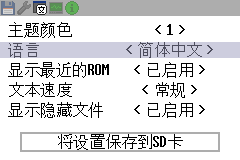
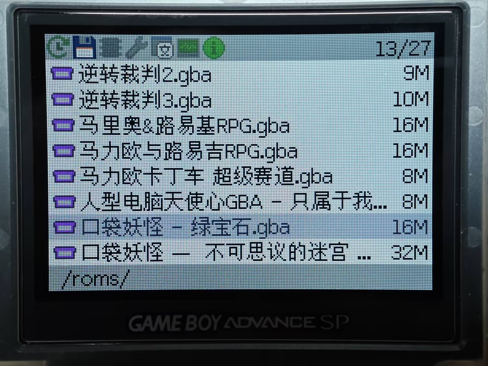

> ⚠️ **WARNING / 警告**
>
> **This fork was produced by vibe coding — using natural language prompts with**
> **DeepSeek AI to describe desired changes, which the AI then implemented.**
> **No manual code review has been performed.**
> **Use at your own risk. The author (Electr0Whale) cannot guarantee correctness or safety.**
>
> **该分支通过 vibe coding 方式生成——用自然语言向 DeepSeek AI 描述需求，**
> **由 AI 完成代码编写。未经人工审查，请谨慎使用。**
> **作者 (Electr0Whale) 无法保证代码的正确性或安全性。**

---

# SuperFW (wqy10pt-font fork)

基于 upstream v0.20 (251752e5)，替换为文泉驿 10pt 点阵宋体。
Based on upstream v0.20 (251752e5), font replaced with WenQuanYi 10pt bitmap Song.

> **下载 / Download**: 最新编译版本在 [CI Pre-release](https://github.com/Electr0Whale/superfw/releases) 中自动发布（含 Chis 实机版 + 模拟器版）。
> The latest build is auto-published as a [CI Pre-release](https://github.com/Electr0Whale/superfw/releases) (includes Chis hardware + emulator versions).

## 改动 / Changes

- **主字体 / Primary font**: 文泉驿 Bitmap Song 10pt (CJK 12px, Latin variable)
- **备用字体 / Secondary font**: Fusion Pixel 12px (optional glyph fallback)
- 可变宽度上限从 8 列扩展至 12 列 / Variable-width extended from 8 to 12 columns
- 新增 `FLAG_FW12` 12px 固定宽度模式 / New FLAG_FW12 fixed-width mode
- `NO_SD_MODE=1` 编译标志，支持 mGBA 等模拟器 / Build flag for emulator testing
- 基线对齐垂直居中 / Baseline-aligned vertical centering
- 中文为默认 UI 语言 / Chinese as default UI language
- 支持语言：中文 / 日本語 / English / Русский / Bahasa Indonesia / Bahasa Melayu
- Fullwidth Forms、Geometric Shapes、CJK Compatibility 等字形块补全
- **随机游戏页**：从当前目录随机选取 7 款 ROM，支持换一批，可在设置中启用/关闭
- 合并 upstream PR #31（Flash 擦写优化，提速 25%）

## 截图 / Screenshots

| 修改前 (upstream) / Before | 修改后 (wqy10pt) / After |
|----------------------------|--------------------------|
|  |  |

| 实机 / Real Hardware |
|----------------------|
|  |

## 编译 / Build

```bash
# 模拟器 / Emulator
make BOARD=chis NO_SD_MODE=1 BUNDLE_GBC_EMULATOR=0 BUNDLE_OTHER_EMULATORS=0

# Chis 真机 / Hardware
make BOARD=chis BUNDLE_GBC_EMULATOR=0 BUNDLE_OTHER_EMULATORS=0
```

## 上游 / Upstream

https://github.com/davidgfnet/superfw

---

## 原始 README / Original README

SuperFW
=======

An alternative firmware for Supercard GBA flash carts

This project aims to provide a more modern and better firmware for Supercard
flash carts (which are still widely used and very cheaply available). The goal
is to add many features only present in more expensive or sophisticated flash
carts. Unfortunately we are limited to the actual hardware so certain features
are impossible or very complex to implement.

Find the website and documentation at https://superfw.davidgf.net/


Installation
------------

Check https://superfw.davidgf.net/docs/install/flash/ for more details.

The firmware can be chain-loaded using another firmware (ie. the default
SuperCard firmware or SCFW) and loaded as a regular game. It can also be
installed on the internal flash device. Installing it enables some nice
features such as SDHC and exFAT compatibility.

To install the firmware you can simply load it first, and then use SuperFW
to flash itself on the flash. You will need to enable flashing in the Info
tab and then pick the .fw file and flash it. It is strongly recommended to
reboot your GBA after flashing.
